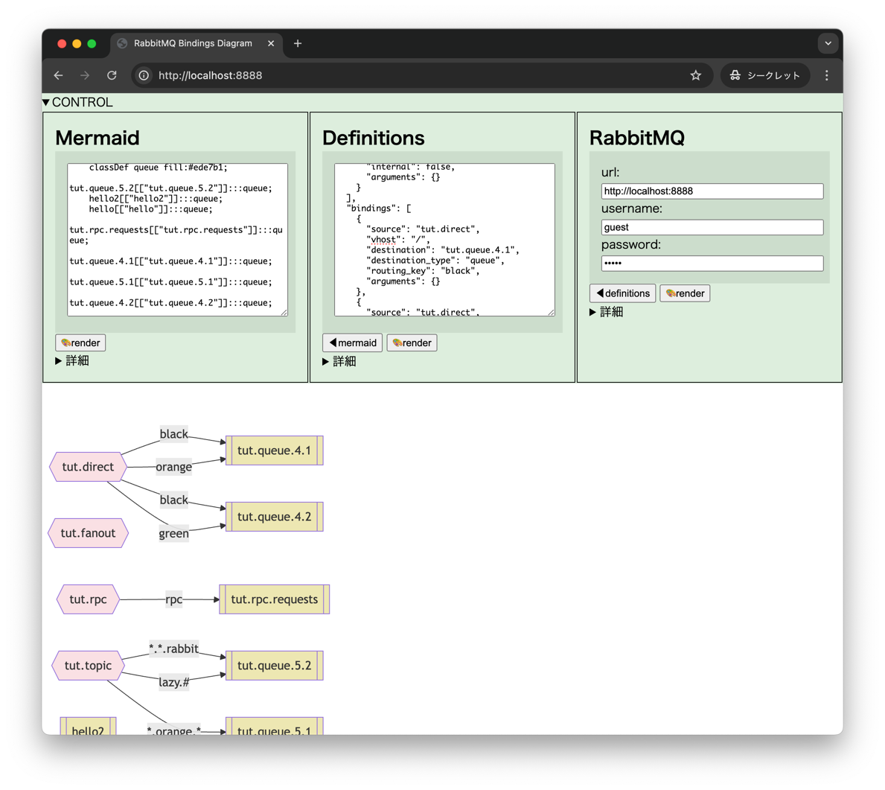

merbbit
============================================================

RabbitMQの簡易可視化ツールです。

- RabbitMQのExchangeとQueueのBindingをMermaidのグラフにします。
- ブラウザだけで動く。お手軽。
- RabbitMQの設定を書くだけでダイアグラムが出る。（接続できるなら。）
- Mermaidが出るので好きに調整できる。（Mermaidの範囲内で。）

## 使う

### GitHub Pages
https://irof.github.io/merbbit/

### ローカルほか
`git clone` でもZIPダウンロードでもして適当なところに配置してください。

## 動作イメージ

[RabbitMQ Tutorials](https://www.rabbitmq.com/tutorials) を一通りやって出力するとこんな感じ。

## メモ

- ダイアグラムの表現は [RabbitMQ Tutorials](https://www.rabbitmq.com/tutorials) に合わせてます。
- しっかり見るなら [AliceMQ](https://github.com/alicelabs/alicemq) とか使うのがいいと思います。
- ブラウザのJSからAPI叩いてるから多分CORS引っかかると思う。正道はRabbitMQの設定だけど、このためにやるのもね。適当に回避するかAPI呼び出しは諦めてDefinitionsから使えばいいと思う。

## 動作確認

- RabbitMQ
    - 4.0.2
    - 3.12.12
    - 3.13 (AmazonMQ)
- Chrome
    - 129.0.6668.60 (macOS)

## LICENSE
